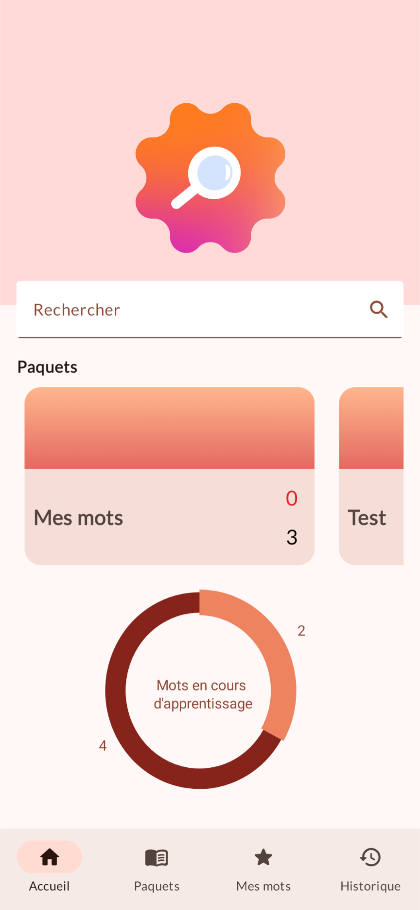
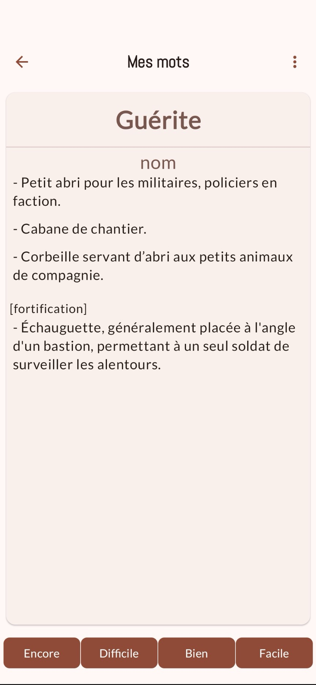
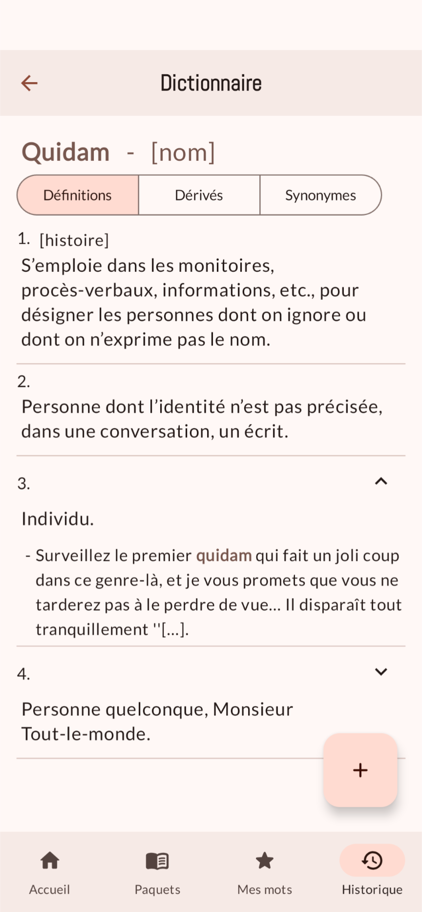

# Word Learning App 📚

This is a Kotlin application designed to help users learn new words effectively, with smart reminders and personalized progress tracking.

## Features 

- **Comprehensive Dictionary**: For now the app includes a selection of around 500 words, pulled from a dictionary licensed from Wikipedia.
- **Synonyms and Derivatives**: Each word entry includes examples, synonyms and derivatives, helping users understand words in context.
- **Customizable Learning**: Users can select specific definitions they want to focus on, tailoring the learning experience to their needs.
- **Adaptive Reminders**: While notifications are not yet implemented, the app still adapts to the user's learning speed. Words that are mastered quickly are shown less frequently, reinforcing learning retention.
- **Progress Tracking**: The app intelligently adapts to your progress. Words you learn faster appear less frequently, helping to optimize review sessions.

## Screenshots 📱

  <table>
    <tr>
      <td align="center">
        <strong>Home Page</strong> 
        
      </td>
      <td align="center">
        <strong>Word Card</strong> 
        
      </td>
      <td align="center">
        <strong>Example Word Details</strong> 
        
      </td>
    </tr>
  </table>

## Future Plans

- **Notifications**: Implement notifications to remind users to review words at optimal intervals.
- **Additional Words**: Gradually expand the dictionary to include more words.
- **Enhanced Personalization**: Continue to refine the adaptive learning algorithm for an even more personalized experience.

## License

This application uses data from Wikipedia and is licensed under the Creative Commons Attribution-ShareAlike 3.0 (CC BY-SA 3.0) license. For more information on the terms of this license, see [CC BY-SA 3.0 License](https://creativecommons.org/licenses/by-sa/3.0/).
